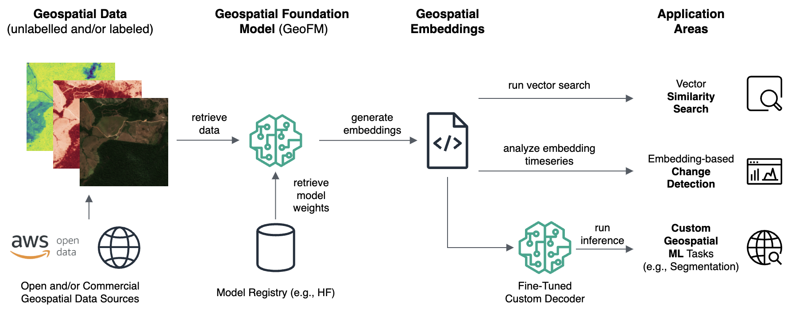
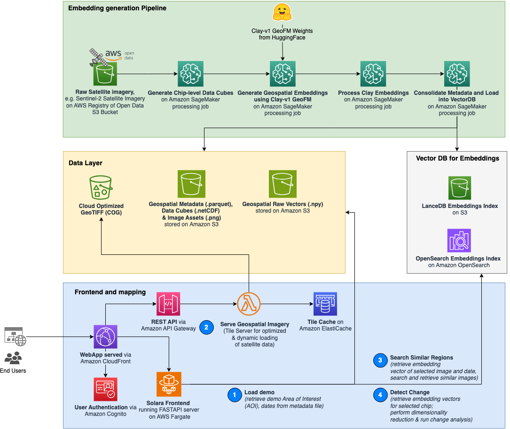

# Leveraging Geospatial Foundation Models (GeoFMs) for Earth-Scale Remote Ecosystem Monitoring
[](https://opensource.org/licenses/MIT)

*Discover how state-of-the-art geospatial vision models can help your organization unlock the power of earth observation data for ecosystem monitoring.*

## Description
Geospatial Foundation Models (GeoFMs) are [Vision Transformers (ViTs)](https://paperswithcode.com/method/vision-transformer) tailored for geospatial data. These large, generative ML models are pre-trained on massive geospatial imagery datasets. This makes them general purpose models that can be leveraged for a wide array of geospatial applications. These include:
1. **Semantic Search**: Quickly map any surface type with a RAG-inspired geospatial embedding search
2. **Change Detection**: Analyze time series of geospatial embeddings to identify surface disruptions over time
3. **Fine-tuning**: Fine-tune a regression, classification or segmentation model for specialized ML tasks (requires labeled data)



## Solution Scope
 This demonstrator showcases the power of GeoFMs for ecosystem monitoring. It is powered by [**Clay-v01**](https://clay-foundation.github.io/model/index.html), a state-of-the-art GFM available on [**HuggingFace**](https://huggingface.co/made-with-clay/Clay). Satellite imagery used in this demo is from ESA's Sentinel-2 mission and is hosted on the [AWS Registry of Open Data](https://registry.opendata.aws/sentinel-2/).

For illustrative purposes this solution uses the example of monitoring deforestation in the Amazon rainforest. However, it can be readily adopted for all kinds of other use cases. The Amazon rainforest is one of the [most biodiverse ecosystems in the world](https://www.copernicus.eu/en/media/image-day-gallery/deforestation-mato-grosso-brazil) and is considered critical in tackling climate change. Yet, there is evidence that the Amazon forest system [could soon reach a tipping point](https://www.nature.com/articles/s41586-023-06970-0), leading to large-scale collapse. Generative vision models for geospatial data - so called **Geospatial Foundation Models (GeoFMs)** - offer a new and powerful technology for mapping the earth's surface at a continental scale, providing stakeholders with the tooling to detect and monitor ecosystem change like forest degradation.

## Architecture

The application follows a three-tiered architecture comprising a Frontend, an AI/ML and Analytics Tier, and a Data Tier. 
Additionally, it incorporates two asynchronous [SageMaker](https://aws.amazon.com/sagemaker/) pipelines for embedding generation and GeoFM fine-tuning. 
The main components are:

1. **Solara Frontend** - A react web application built with [Solara](https://solara.dev/documentation), hosted on [AWS Fargate](https://aws.amazon.com/fargate/), and served through [CloudFront](https://aws.amazon.com/cloudfront/) CDN. Authentication is handled by [Amazon Cognito](https://aws.amazon.com/pm/cognito/?gclid=CjwKCAiAudG5BhAREiwAWMlSjIMQlGJruxjBD8L18Z4S84V0GeBmiqRpt9dZcvaRquyQZakBXj51JhoCRXUQAvD_BwE&trk=3e612152-ae90-4f91-abda-680eead5127a&sc_channel=ps&ef_id=CjwKCAiAudG5BhAREiwAWMlSjIMQlGJruxjBD8L18Z4S84V0GeBmiqRpt9dZcvaRquyQZakBXj51JhoCRXUQAvD_BwE:G:s&s_kwcid=AL!4422!3!651541907485!e!!g!!amazon%20cognito!19835790380!146491699385).
2. **Serve Geospatial Imagery Lambda** - Provides a tile server using [TiTiler](https://github.com/developmentseed/titiler) with [Amazon ElastiCache](https://aws.amazon.com/elasticache/) for low-latency geospatial imagery serving.
3. **Search Similar Regions function** - Performs similarity searches based on a chip ID and vector search parameters, utilizing [Amazon OpenSearch Service](https://aws.amazon.com/opensearch-service/).
4. **Detect Change function** - Conducts change detection by analyzing time series of embedding vectors retrieved from Amazon OpenSearch Service.
5. **Geo Embedding Generation Pipeline** - A SageMaker Pipeline for retrieving, preprocessing [Sentinel-2](https://www.esa.int/Applications/Observing_the_Earth/Copernicus/Sentinel-2) data, and generating geospatial embeddings using a pre-trained GeoFM from HuggingFace Hub. These embedding are then loaded into a [LanceDB](https://lancedb.github.io/lancedb/) vector database to enable semantic search.




## Getting Started

To get started, perform the following steps:

1. Run Geospatial ML Pipeline for your area of interest:
    * Navigate to `sagemaker-pipelines` folder.
    * Follow steps laid out in the respective notebooks in the `prerequisites` folder:
        * Build and push the `clay_gpu_docker_image` to ECR 
        * Build and push the `geospatial_processing_image` to ECR 
    * Go to `embedding_generation` folder and run `embedding_generation_pipeline.ipynb` to instantiate and execute the SageMaker Pipeline for your Area of Interest (AOI) 
    * Wait until the pipeline has completed successfully
    * Retrieve the `config.json` file from the output bucket. You can find it at the following path of the main data bucket named `aws-geofm-data-bucket-{AWS_ACCOUNT_NUMER}-{AWS_REGION}-{env_name}`:

    ```
        output/
        └── <aoi_name>/
            └── consolidated-output/
                └── <MGRS_grid>/
                    └── config_<aoi_name>.json
    ```

2. Deploy the UI stack:
    * Navigate to the [UI](./ui/geofm-demo-stack/) folder
    * Update the config file by pasting the contents of the previously retrieved `config.json`
    * follow the instructions from the `ui/geofm-demo-stack/README.md` file to deploy the UI CDK Stack


## Cleanup
The solution uses [Authorization@Edge](https://aws.amazon.com/blogs/networking-and-content-delivery/authorizationedge-how-to-use-lambdaedge-and-json-web-tokens-to-enhance-web-application-security/) for serverless authorization of viewers using [Amazon CloudFront](https://aws.amazon.com/cloudfront/), [Lambda@Edge](https://aws.amazon.com/lambda/edge/) and [Amazon Cognito](https://aws.amazon.com/cognito/). Since [Lambda@Edge replicas are usually deleted within a few hours](https://docs.aws.amazon.com/AmazonCloudFront/latest/DeveloperGuide/lambda-edge-delete-replicas.html), you’ll need to wait that long after deleting the solution before you can manually delete the associated Lambda function from AWS Lambda.

## Authors and acknowledgment
* Karsten Schroer
* Bishesh Adhikari
* Iza Moise

## License
[](https://opensource.org/licenses/MIT)
