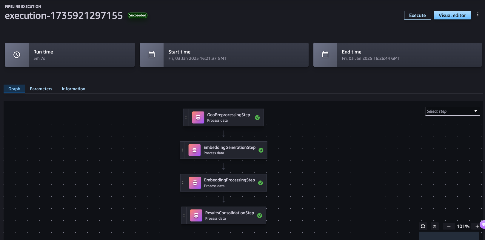

# Amazon SageMaker Pipelines for large-scale distributed geospatial processing and training

This directory contains code for specifying, parameterizing and orchestrating 
- large-scale distributed processing pipelines for raw satellite image processing and embedding generation (see `/embedding_generation`) 
- GeoFM fine-tuning jobs for semantic segmentation (see `/model_fine_tuning`).

All routines are implemented as SageMaker Steps and orchestrated using [SageMaker Pipelines](https://docs.aws.amazon.com/sagemaker/latest/dg/pipelines.html).

## Prerequisites
(see `/prerequisites`)

The following Docker images must be built and registered in [Amazon Elastic Container Registry (ECR)](https://aws.amazon.com/de/ecr/):
- `geospatial-processing-img`: Contains dependencies for geospatial processing (e.g., `gdal`, `geopandas`, `shapely`, `rasterio`, `rioxarray`, `pystac`, etc.)
- `clay-gpu-img`: Contains GPU-enabled dependencies for GeoFM deployment and model weights (retrieved from HF)

## Getting Started

1. Build and register required Docker images.
   Run the following two notebooks to build the custom ECR images:
   1. [Build Custom Glay GPU Image](./prerequisites/clay_gpu_docker_image/build-custom-clay-gpu-image.ipynb)
   2. [Build Custom Geo Processing Image](./prerequisites/geospatial_processing_image/build-custom-geo-image.ipynb)

   (*Note*: When building from Amazon SageMaker Notebook instances (i.e. `ml.m5.xlarge`), use minimum of 75GB disk space on the instance)
2. Configure and Execute the SageMaker Pipelines for your Area of Interest (AOI) by running the [Embedding Generation Pipeline](./embedding_generation/embedding_generation_pipeline.ipynb) notebook
3. Ensure the SageMaker Pipelines is executed successfully and go to [UI](../ui/geofm-demo-stack/README.md) folder to deploy the UI.

## Embedding Generation Pipeline
> (see `/embedding_generation`)

Pipeline for processing satellite imagery and generating embeddings. The pipeline is tailored for Sentinel-2 imagery. It can be adapted with minimal code changes for any kind of raster-based satellite imagery.

#### Pipeline Inputs

* a `.geojson` of the Area of Observation (AOI) for which you want to generate embeddings
* an S3 bucket for saving intermediate pipeline outputs and final results
* pipeline parameters (e.g., chip size, etc.)


#### Pipeline Steps



1. __Step 1 - Pre-process Satellite Tile__
   - Divides satellite tiles into n×n pixel chips
   - Generates NetCDF datacubes (`.netcdf`) and PNG thumbnails (`.png` ) per each chip
   - Creates metadata in Parquet format (`.parquet`)
   - Distribution strategy: by Sentinel-2 tile id (e.g., `S2A_20LPP_20220606_0_L2A`)
   - Input structure:

      ```
      processing/
      └── <aoi_name>/
         └── input/
            ├── sentinel2_scenes/
                └── <s2_scene_id>_metadata.json
                └── <s2_scene_id>_metadata.json
                └── ...
      ``` 

   - Output structure:

      ```
      output/
      └── <aoi_name>/
         ├── meta/
         │   ├── <s2_scene_id>_chip_meta.parquet
         │   └── ...
         ├── raw-chips/
         │   └── <s2_product_level>/
         │       └── <MGRS_grid>/
         │           └── <year>/
         │               └── <month>/
         │                   └── <s2_scene_id>_<chip_size>_chipped_<x_dim>_<y_dim>.nc
         └── rgb-imgs/
            └── <s2_product_level>/
                  └── <MGRS_grid>/
                     └── <year>/
                        └── <month>/
                              └── <s2_scene_id>_<chip_size>_rgb_thumbnail_<x_dim>_<y_dim>.png

      ```

2. __Step 2 - Generate Embeddings__
   - Generates patch and class embeddings per each chip
   - Uses a pre-trained geospatial embedding models (Clay_v1) hosted on HuggingFace
   - Stores embeddings as NumPy arrays (`.npy`)
   - Tracks file paths of generated embedding vectors by updating the metadata `.parquet` on S3
   - Generates a simple text file (`.txt`) per each unique step. These files are used for distribution in later pipeline steps.
   - Distribution strategy: by Sentinel-2 tile id (e.g., `S2A_20LPP_20220606_0_L2A`)
   - Output structure:

      ```
      output/
      └── <aoi_name>/
         ├── meta/
         │   └── <s2_scene_id>_chip_meta.parquet
         ├── embeddings/
         │   └── <s2_product_level>/
         │       └── <MGRS_grid>/
         │           └── <year>/
         │               └── <month>/
         │                   ├── <s2_scene_id>_<chip_size>_chip_cls_embeddings_<bands>_<x_dim>_<y_dim>.npy
         │                   └── <s2_scene_id>_<chip_size>_chip_patch_embeddings_<bands>_<x_dim>_<y_dim>.npy
         └── unique-chip-ids/
            └── <MGRS_grid>/
                  └── <x_dim>_<y_dim>.txt
      ```

3. __Step 3 - Process Embeddings:__
   - Runs dimensionality reduction on the patch or class embedding vector (if distributed processing is used these will be run on a subsample of the full dataset)
   - Per each chip: computes cosine similarity over time versus a baseline date (the first date in the series)
   - Distribution strategy: by chip_id (e.g., `12_25`)
   - Output structure:

      ```
      output/
      └── <aoi_name>/
         └── processed-embeddings/
            └── <MGRS_grid>/
                  └── <x_dim>_<y_dim>_processed_embeddings.parquet
      ```

4. __Step 4 - Consolidate Metadata and Load into Vector DB:__
   - Consolidates processed embedding `.parquet` files into a single results file per Sentinel-2 grid ID (i.e., MGRS grid) and loads vectors and metadata into a [LanceDB](https://lancedb.github.io/lancedb/) vector database. Also generates `.geojson` files that contain chips to be used as an overlay in the frontend.
   - Distribution strategy: none
   - Output structure:

      ```
      output/
      └── <aoi_name>/
         └── consolidated-output/
            └── <MGRS_grid>/
                  └── consolidated_output.parquet
                  └── chip_grid_aoi.geojson
                  └── chip_grid_full_s2_tile.geojson
                  └── config_<aoi_name>.json
         └── lance-db/
            └── vector_db.lance
      ```

## GeoFM Fine-Tuning Pipeline

Please see the [Clay-v1 documentation](https://clay-foundation.github.io/model/finetune/segment.html) for a selection of fine-tuning examples, including segmentation, classification and regression.

